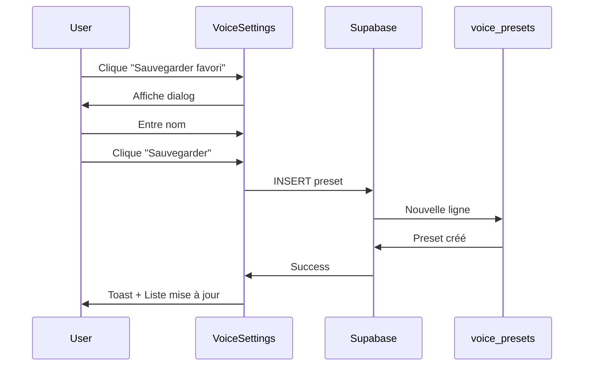
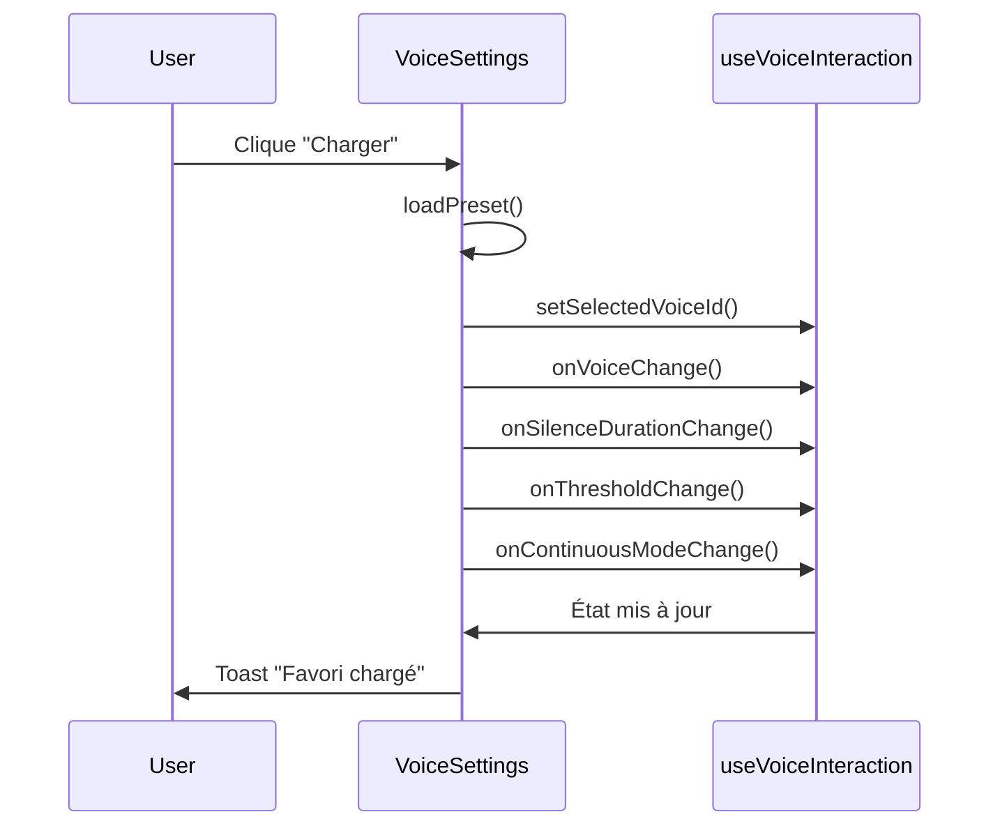

# Guide des Favoris de Configuration Vocale (Voice Presets)

## Vue d'ensemble

Le système de favoris permet aux utilisateurs de sauvegarder et charger rapidement différentes configurations vocales personnalisées pour iAsted.

### Fonctionnalités

- ✅ Sauvegarder des configurations complètes (voix + paramètres)
- ✅ Charger instantanément un favori sauvegardé
- ✅ Gérer plusieurs favoris par utilisateur
- ✅ Supprimer des favoris inutilisés
- ✅ Voir les détails de chaque configuration

---

## Architecture

### Table `voice_presets`

```sql
CREATE TABLE public.voice_presets (
  id UUID PRIMARY KEY,
  user_id UUID REFERENCES auth.users(id),
  name TEXT NOT NULL,
  voice_id TEXT NOT NULL,
  voice_silence_duration INTEGER DEFAULT 2000,
  voice_silence_threshold INTEGER DEFAULT 10,
  voice_continuous_mode BOOLEAN DEFAULT false,
  is_default BOOLEAN DEFAULT false,
  created_at TIMESTAMPTZ,
  updated_at TIMESTAMPTZ,
  UNIQUE(user_id, name)
);
```

### Champs

- **name**: Nom du favori (unique par utilisateur)
- **voice_id**: ID de la voix ElevenLabs
- **voice_silence_duration**: Durée de silence en ms (500-3000)
- **voice_silence_threshold**: Sensibilité micro en % (10-100)
- **voice_continuous_mode**: Mode continu activé/désactivé
- **is_default**: Marque un favori comme défaut (fonctionnalité future)

---

## Interface utilisateur

### Emplacement

Page: **iAsted → Paramètres**

### Layout

```
┌─────────────────────────────────────────┐
│  ★ Favoris                              │
│  Configurations vocales sauvegardées    │
│                                         │
│  [Favori 1]  [Favori 2]  [Favori 3]   │
│                                         │
└─────────────────────────────────────────┘

┌─────────────────────────────────────────┐
│  Paramètres Vocaux                      │
│                                         │
│  Voix: [Sarah ▼]  [▶]                  │
│  Durée silence: 2000ms                  │
│  Sensibilité: 50%                       │
│  Mode continu: [OFF]                    │
│                                         │
│  [★ Sauvegarder favori] [💾 Sauvegarder]│
└─────────────────────────────────────────┘
```

### Carte de favori

Chaque favori affiche:
- **Nom** du favori
- **Voix** utilisée
- **Durée de silence** en ms
- **Sensibilité** en %
- **Mode continu** (Activé/Désactivé)
- Bouton **"Charger"** pour appliquer la configuration
- Bouton **"Supprimer"** (icône poubelle)

---

## Utilisation

### 1. Créer un favori

1. Configurez les paramètres vocaux souhaités:
   - Sélectionnez une voix
   - Ajustez la durée de silence
   - Réglez la sensibilité
   - Activez/désactivez le mode continu

2. Cliquez sur **"★ Sauvegarder comme favori"**

3. Entrez un nom descriptif:
   - Ex: "Voix grave et rapide"
   - Ex: "Sarah - Mode continu"
   - Ex: "Configuration réunion"

4. Cliquez sur **"Sauvegarder"**

5. Le favori apparaît dans la section Favoris

### 2. Charger un favori

1. Dans la section Favoris, trouvez le favori souhaité

2. Cliquez sur le bouton **"↓ Charger"**

3. Tous les paramètres sont appliqués instantanément:
   - La voix change
   - Les sliders s'ajustent
   - Le mode continu est mis à jour

4. Toast de confirmation: "Favori [nom] chargé"

### 3. Supprimer un favori

1. Cliquez sur l'icône **poubelle** (🗑️) du favori

2. Le favori est supprimé immédiatement

3. Toast de confirmation: "Favori [nom] supprimé"

### 4. Modifier les préférences globales

Pour sauvegarder les modifications **sans créer de favori**:

1. Ajustez les paramètres

2. Cliquez sur **"💾 Sauvegarder les préférences"**

3. Les préférences sont sauvegardées dans `user_preferences`

---

## Cas d'usage

### Exemple 1: Plusieurs contextes d'utilisation

**Besoin**: L'utilisateur utilise iAsted dans différents contextes

**Solution**: Créer des favoris adaptés

```
Favoris sauvegardés:
├── "Bureau - Calme" 
│   └── Voix Sarah, silence 3000ms, sensibilité 30%
├── "Terrain - Bruyant"
│   └── Voix Roger, silence 1000ms, sensibilité 80%
└── "Réunion - Mode continu"
    └── Voix Laura, silence 2000ms, mode continu ON
```

### Exemple 2: Test de différentes voix

**Besoin**: Comparer plusieurs voix ElevenLabs

**Solution**: Créer un favori par voix

```
Favoris:
├── "Test - Sarah"
├── "Test - Roger"
├── "Test - Laura"
└── "Test - George"
```

Puis charger chaque favori et tester en conditions réelles.

### Exemple 3: Partage de configurations

**Besoin**: Recommander une configuration à un collègue

**Solution**: 
1. Créer un favori avec nom descriptif
2. Noter les paramètres exacts
3. Le collègue recrée le même favori manuellement

---

## Flux de données

### Création d'un favori



### Chargement d'un favori



---

## Sécurité

### RLS Policies

Chaque utilisateur peut uniquement:
- ✅ Voir ses propres favoris
- ✅ Créer ses propres favoris
- ✅ Modifier ses propres favoris
- ✅ Supprimer ses propres favoris
- ❌ Accéder aux favoris d'autres utilisateurs

### Validation

- **Nom unique** par utilisateur (contrainte UNIQUE)
- **Longueur max** du nom: 255 caractères (TEXT)
- **Paramètres valides**:
  - `voice_silence_duration`: 500-3000
  - `voice_silence_threshold`: 10-100
  - `voice_continuous_mode`: boolean

---

## API

### Récupérer les favoris

```typescript
const { data: presets } = await supabase
  .from('voice_presets')
  .select('*')
  .eq('user_id', user.id)
  .order('is_default', { ascending: false })
  .order('name', { ascending: true });
```

### Créer un favori

```typescript
const { data: preset } = await supabase
  .from('voice_presets')
  .insert({
    user_id: user.id,
    name: 'Mon favori',
    voice_id: 'voice_123',
    voice_silence_duration: 2000,
    voice_silence_threshold: 50,
    voice_continuous_mode: false,
  })
  .select()
  .single();
```

### Charger un favori

```typescript
function loadPreset(preset: VoicePreset) {
  setSelectedVoice(preset.voice_id);
  setSilenceDuration(preset.voice_silence_duration);
  setThreshold(preset.voice_silence_threshold);
  setContinuousMode(preset.voice_continuous_mode);
  
  // Notifier les composants parents
  onVoiceChange?.(preset.voice_id);
  onSilenceDurationChange?.(preset.voice_silence_duration);
  onThresholdChange?.(preset.voice_silence_threshold);
  onContinuousModeChange?.(preset.voice_continuous_mode);
}
```

### Supprimer un favori

```typescript
await supabase
  .from('voice_presets')
  .delete()
  .eq('id', presetId);
```

---

## Évolutions futures

### Court terme
- [ ] Marquer un favori par défaut (`is_default`)
- [ ] Charger automatiquement le favori par défaut au démarrage
- [ ] Renommer un favori existant
- [ ] Dupliquer un favori

### Moyen terme
- [ ] Exporter/Importer des favoris (JSON)
- [ ] Partager un favori avec d'autres utilisateurs
- [ ] Trier les favoris (par nom, date, usage)
- [ ] Tags/Catégories pour organiser les favoris

### Long terme
- [ ] Favoris suggérés par l'IA basés sur l'usage
- [ ] Synchronisation cloud entre appareils
- [ ] Templates de favoris pré-configurés
- [ ] Analytics d'utilisation des favoris

---

## Dépannage

### Erreur "Un favori avec ce nom existe déjà"

**Cause**: Nom en double pour le même utilisateur

**Solution**: Choisir un autre nom

### Favori ne se charge pas

**Vérifications**:
1. Voix existe toujours dans ElevenLabs?
2. Paramètres dans les plages valides?
3. Connexion à la base de données OK?

### Favoris ne s'affichent pas

**Causes possibles**:
- Problème RLS policies
- Utilisateur non authentifié
- Erreur de chargement initial

**Debug**:
```typescript
// Console logs dans useEffect
console.log('User:', user);
console.log('Presets loaded:', presets);
```

---

## Ressources

- **Table**: `voice_presets`
- **Composant**: `src/components/minister/VoiceSettings.tsx`
- **Page**: `src/pages/minister/IAsted.tsx` (onglet Paramètres)
- **Documentation API**: [IASTED_API_USAGE.md](./IASTED_API_USAGE.md)

---

**Dernière mise à jour**: 2025-11-09  
**Statut**: ✅ Production Ready
